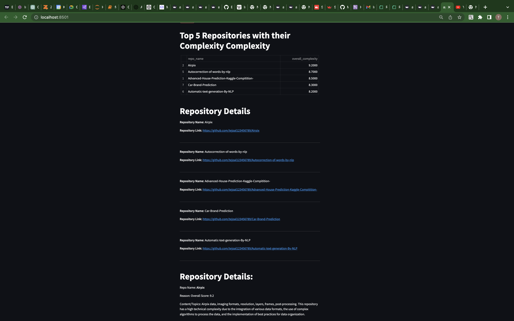

# Mercor-project

## GitHub Automated Analysis

This project aims to provide automated analysis through GitHub. It leverages the power of GPT models to analyze code and provide valuable insights.

## Steps to Run the Project on Your System:

Step 1: Create a virtual environment using conda:
`conda create -n <Name> -y`

Step 2: Install project dependencies:
`pip3 install -r requirements.txt`

Step 3: Obtain an OpenAI API key and store it in the `.streamlit/secrets.toml` file. If the folder and file don't exist, create them.

Step 4: Call the OpenAI API key in the `backend/main.py` file.

Step 5: Start the application using Streamlit:
`streamlit run app.py`

## Key Things About the Project:

1. Chunking Technique: To avoid exceeding the GPT model's limits, the project utilizes a technique called chunking. This technique splits the code into smaller parts for processing.

2. Streamlit Frontend: The project uses Streamlit, a powerful Python library for building interactive web applications, for the frontend interface.

## Deployment:

Unfortunately, hosting the project on any platform is currently not possible as the API_KEY becomes invalid whenever I try to do so. However, I have showcased a demo in a YouTube video and also provided a screenshot of the final output below:

